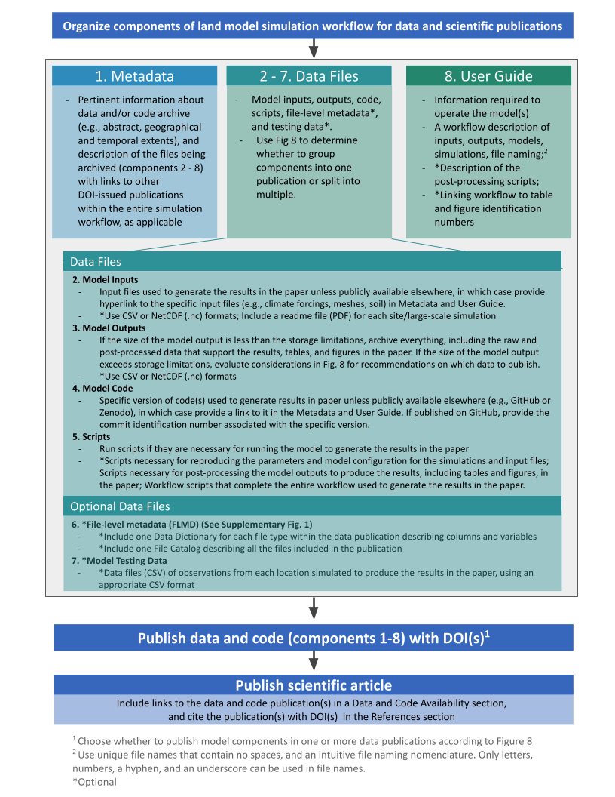
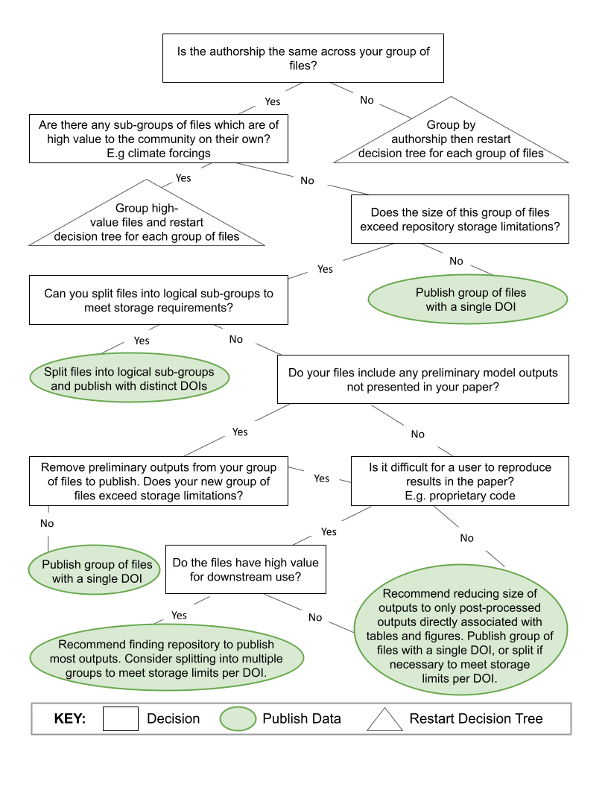
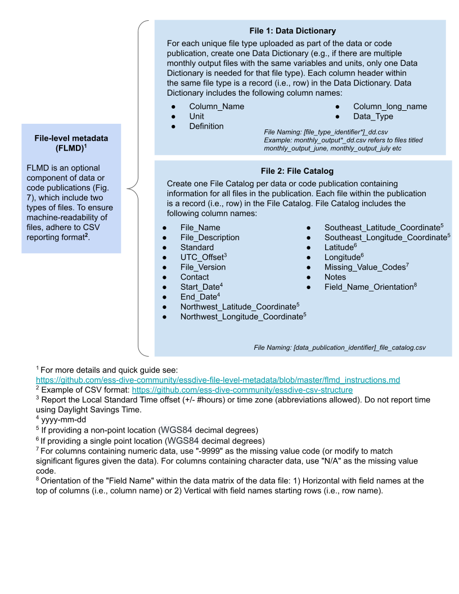

# Using the model data archiving guidelines

We compiled this set of model data archiving guidelines based on a review of existing model archiving practices, and also a survey of Earth and Environmental modelers. Based, on the information we collected, we provide a set of guidelines that can help modelers decide how to organize and archive data from their land model simulations.

We have organized the model data archiving guidelines in three sections.  
1. [File organization](#file-organization): Guidelines for organizing model data files that are associated with a scientific publication  
2. [Decision tree](#decision-tree): A decision tree to help users decide which files to archive
3. [File-level metadata](#file-level-metadata): A deeper look at one component of the model data guidelines  

---

### 1. File organization  

The figure below provides a visual depiction of how to organize some of the most common files associated with model data.  The files are either **metadata**, **data files**, or a **user guide**.

Once the model data and all associated files are prepared, all files and software can be published in a long-term data archive and assigned a DOI. 

Then, the scientific article resulting from the model data can be submitted for publication, including citations for both model data and code in the references section of the manuscript.

---  
### 2. Decision tree  

In our survey of the ESS modeling community, we found that modelers often struggled with deciding which model data to archive. These decisions were related to authorship of different components of the model data package, as well as repository storage limits.

We created the decision tree that summarizes the most common decisions that modelers have to make when archiving data. We then provide suggestions for *which* files to archive, and *when* to submit the data to a public archive.  

--- 
### 3. File-Level Metadata  

We suggest researchers archiving model data include 2 types of file-level metadata 
  

