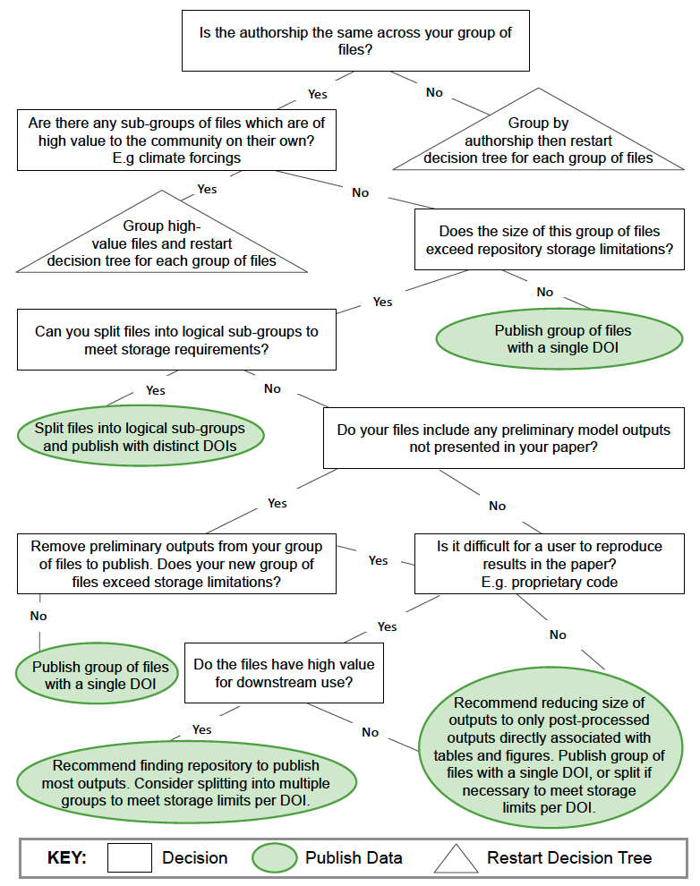
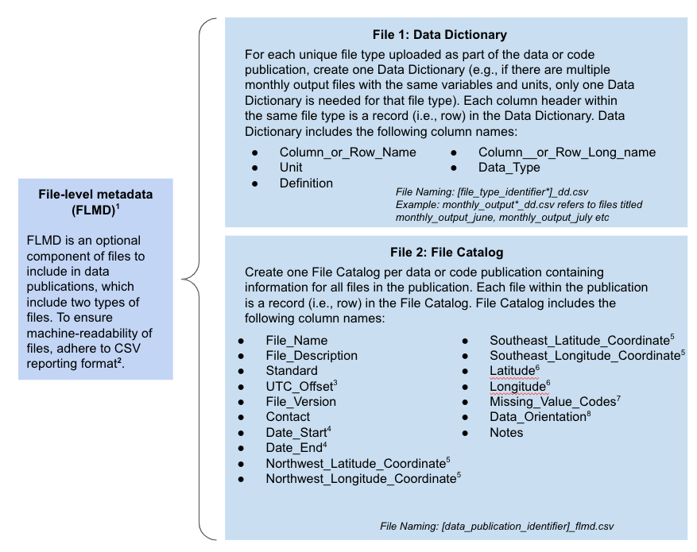

# Using the model data archiving guidelines

We compiled this set of model data archiving guidelines from on a review of existing model archiving practices and also input from land modelers. Based on the information we collected, we provide a set of guidelines that can help modelers decide how to organize and archive data from their land model simulations.

We have organized the model data archiving guidelines in three sections.  
1. [Files to include](#1-files-to-include): Guidelines for organizing model data files that are associated with a scientific publication  
2. [Deciding how to bundle files](#2-deciding-how-to-bundle-files): A decision tree to help users decide how to group files for archive
3. [File-level metadata](#3-file-level-metadata): A deeper look at one component of the model data guidelines  

---
### 1. Files to include   

1. **Metadata** – This refers to pertinent information about data and code archived (e.g., abstract, geographical and temporal extents), as well as description of the files being archived with links to other DOI-issued publications within the entire simulation workflow, as applicable.  
2. **Required Data Files** – Archived datasets should specify or include model inputs, outputs, code, and scripts depending on whether the data are published elsewhere or exceed repository dataset size limits. File names should be unique and can use an intuitive file naming nomenclature to help with discoverability. File names should only contain letters, numbers, hyphens, and underscores and should not contain spaces.  
    1. **Model Inputs** – Input files should be included unless publicly available elsewhere, in which case a hyperlink to the specific input files (e.g., climate forcings, meshes, soil parameterizations) should be provided in the metadata and user guide. Use open-sourced formats such as comma separated value (.csv) or NetCDF (.nc) formats.  
    2.	**Model Outputs**- Archive all model outputs if the size of the data files are within the repository storage limitations. This should include the raw and post-processed data that support the results, conclusions, and if associated with a publication the tables, and figures. If the size of the model output exceeds repository storage limitations, evaluate recommendations based on the decision tree (see Figure 2 in Simmonds et al. in review) on which data to publish. Use open-sourced formats such as comma separated value (.csv) or NetCDF (.nc) formats.  
    3.	**Model Code** – Include specific version of code(s) used to generate results in paper unless the code is publicly available elsewhere (e.g., GitHub or Zenodo). Include links to any external model codes in the metadata and user guide. If published on GitHub, provide the commit identification number associated with the specific version.   
    4.	**Scripts** – Include run scripts if they are necessary for running the model to generate published results. Optionally also include scripts necessary for reproducing the parameters and model configuration for the simulations and input files, for post-processing model outputs to produce the results (e.g., tables and figures in a publication), and scripts of the entire workflow used to generate the model results.  
3.	**Optional Files** –  
    1.	 \***File-level metadata** (FLMD) – Include descriptions of all the data files as one file catalog see [file-level metadata reporting format](https://github.com/ess-dive-community/essdive-file-level-metadata). Optionally also include one data dictionary for each file type within the data publication describing columns and variables.  
    2.	**Model Testing Data**- Include data files in open source format (e.g., CSV) of observations from each location simulated to produce the results in the paper.  
    3.	**Documentation or user guide** - Include a readme file (e.g., pdf) for each site-specific or large-scale simulation and provide details on required data or code dependencies.  
4.	**Use in publications** - If publishing model results, include links to the data and code publication(s) in the Data or Code Availability section, and cite the dataset publication(s) with DOI(s) in the references section.  	

---   

### 2. Deciding how to bundle files  

The decision tree below provides suggestions for which files to archive, and when to submit data to a public archive using the following considerations:  
- Repository storage limitations  
- Authorship  
- Downstream value  

  

--- 
### 3. File-Level Metadata   

We suggest researchers archiving model data include 2 types of file-level metadata. For more details see [ESS-DIVE File-level Metadata](https://github.com/ess-dive-community/essdive-file-level-metadata). Note that one possible option is to use ncdump to create a metadata CSV file for NetCDF and HDF5 files.  

  

&#185; For more details on how to provide file-level metadata [see here](https://github.com/ess-dive-community/essdive-file-level-metadata)  
&#178; Details for the [CSV reporting format](https://github.com/ess-dive-community/essdive-csv-structure)  
&#179; Report the Local Standard Time offset (+/- #hours) or time zone (abbreviations allowed). Do not report time using Daylight Savings Time  
&#8308; yyyy-mm-dd  
&#8309; If providing a non-point location (WGS84 decimal degrees)  
&#8310; If providing a single point location (WGS84 decimal degrees)  
&#8311; For columns containing numeric data, use "-9999" as the missing value code (or modify to match significant figures given the data). For columns containing character data, use "N/A" as the missing value code.  
&#8312; Orientation of the "Field Name" within the data matrix of the data file: 1) Horizontal with field names at the top of columns (i.e., column name) or 2) Vertical with field names starting rows (i.e., row name).  
