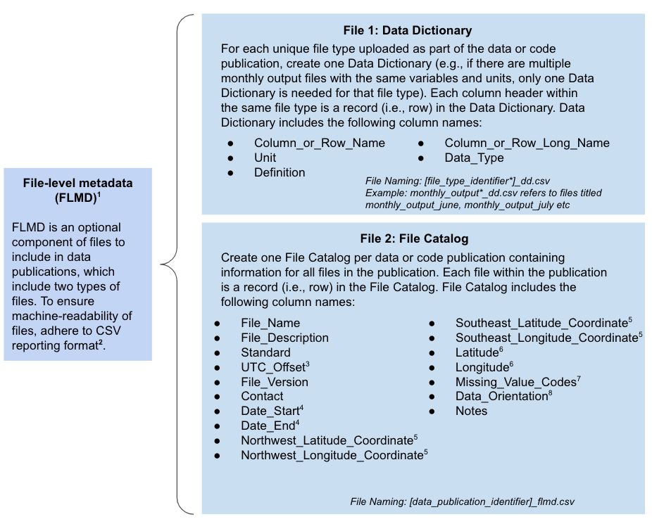

# Using the model data archiving guidelines

We compiled this set of model data archiving guidelines from on a review of existing model archiving practices and also input from land modelers. Based on the information we collected, we provide a set of guidelines that can help modelers decide how to organize and archive data from their land model simulations.

We have organized the model data archiving guidelines in three sections.  
1. [Files to include](#1-files-to-include): Guidelines for organizing model data files that are associated with a scientific publication  
2. [Deciding how to bundle files](#2-deciding-how-to-bundle-files): A decision tree to help users decide how to group files for archive
3. [File-level metadata](#3-file-level-metadata): A deeper look at one component of the model data guidelines  

---
### 1. Files to include   

---   

### 2. Deciding how to bundle files  

The decision tree below provides suggestions for which files to archive, and when to submit data to a public archive using the following considerations:  
- Repository storage limitations  
- Authorship  
- Downstream value  

  

--- 
### 3. File-Level Metadata   

We suggest researchers archiving model data include 2 types of file-level metadata. For more details see [ESS-DIVE File-level Metadata](https://github.com/ess-dive-community/essdive-file-level-metadata). Note that one possible option is to use ncdump to create a metadata CSV file for NetCDF and HDF5 files.  

  

&#185; For more details on how to provide file-level metadata [see here](https://github.com/ess-dive-community/essdive-file-level-metadata)  
&#178; Details for the [CSV reporting format](https://github.com/ess-dive-community/essdive-csv-structure)  
&#179; Report the Local Standard Time offset (+/- #hours) or time zone (abbreviations allowed). Do not report time using Daylight Savings Time  
&#8308; yyyy-mm-dd  
&#8309; If providing a non-point location (WGS84 decimal degrees)  
&#8310; If providing a single point location (WGS84 decimal degrees)  
&#8311; For columns containing numeric data, use "-9999" as the missing value code (or modify to match significant figures given the data). For columns containing character data, use "N/A" as the missing value code.  
&#8312; Orientation of the "Field Name" within the data matrix of the data file: 1) Horizontal with field names at the top of columns (i.e., column name) or 2) Vertical with field names starting rows (i.e., row name).  
